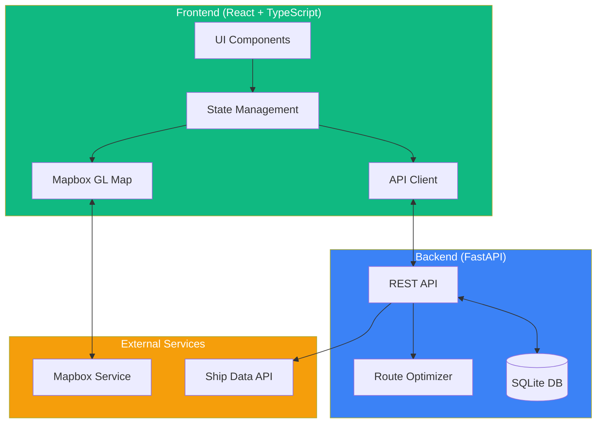
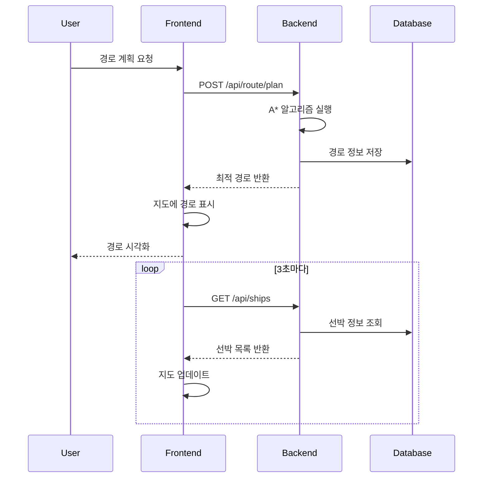
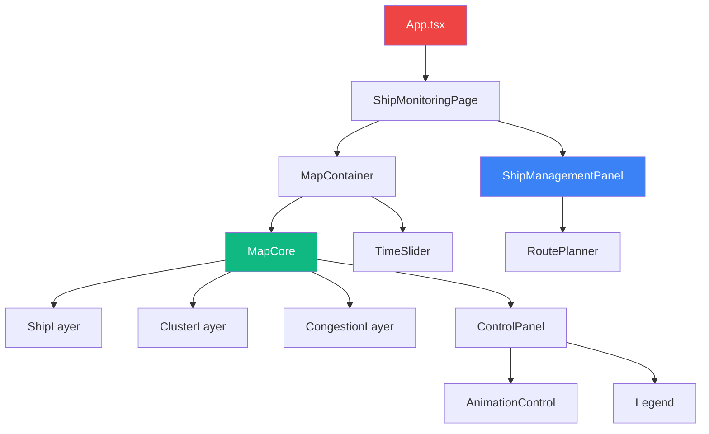
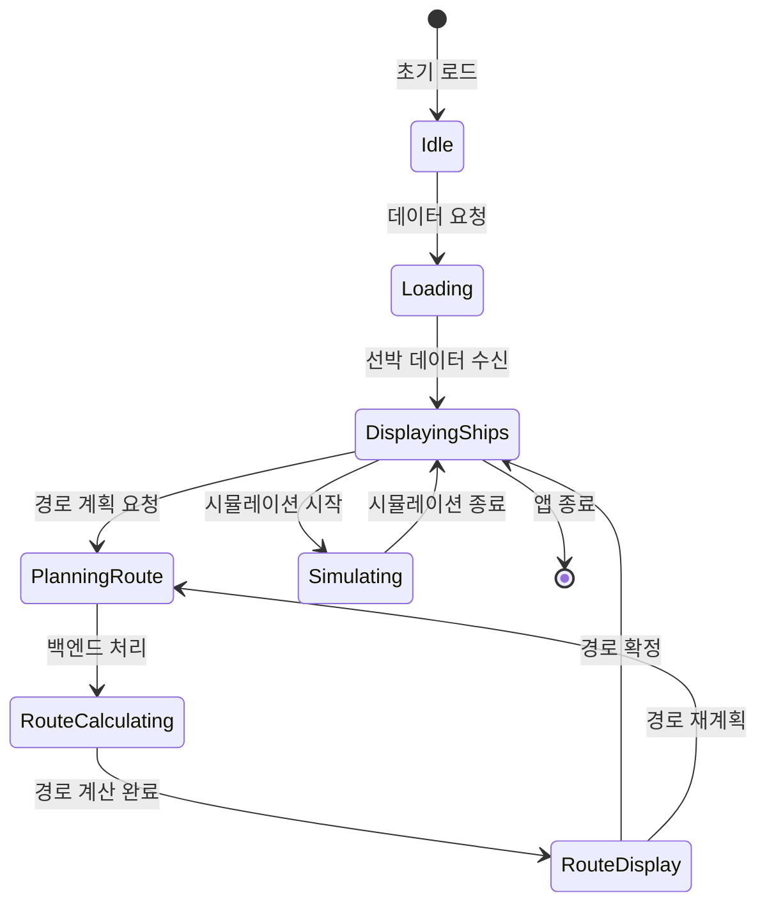

# 🚢 K-CHAT FRONT - 실시간 선박 관제 시스템

## 📋 프로젝트 개요

구룡포항 해역의 선박들을 실시간으로 모니터링하고 최적 경로를 계획하는 웹 기반 관제 시스템입니다. React와 TypeScript를 기반으로 Mapbox GL을 활용하여 2D/3D 지도 시각화를 제공하며, FastAPI 백엔드와 연동하여 AI 기반 경로 최적화를 수행합니다.

### 🌟 주요 특징

- **실시간 선박 모니터링**: 구룡포항 주변 선박들의 위치와 상태를 실시간 추적
- **AI 경로 최적화**: A* 알고리즘 기반 최적 경로 계산 및 충돌 회피
- **2D/3D 지도 전환**: Mapbox GL을 활용한 다양한 시각화 모드
- **시간 시뮬레이션**: 시간대별 선박 이동 경로 예측 및 시뮬레이션
- **클러스터링 분석**: 선박 밀집도 히트맵 및 혼잡도 분석
- **Glass Morphism UI**: 현대적이고 직관적인 사용자 인터페이스

## 🏗️ 시스템 아키텍처



## 🔄 데이터 플로우



## 🧩 컴포넌트 구조



## 📊 상태 관리 플로우



## 🚀 시작하기

### 필수 요구사항

- Node.js 18.0 이상
- npm 또는 yarn
- Mapbox Access Token

### 설치 및 실행

```bash
# 저장소 클론
git clone https://github.com/LimJih00n/K-CHAT_FRONT.git
cd ship-control

# 의존성 설치
npm install

# 개발 서버 실행
npm run dev
```

### 환경 설정

1. Mapbox 토큰 설정
   - `src/components/Map/MapCore.tsx`에서 `MAPBOX_ACCESS_TOKEN` 수정

2. 백엔드 API 연결
   - `src/services/navigationApi.ts`에서 `API_BASE_URL` 수정

## 📁 프로젝트 구조

```
ship-control/
├── src/
│   ├── components/          # React 컴포넌트
│   │   ├── Map/            # 지도 관련 컴포넌트
│   │   │   ├── MapCore.tsx
│   │   │   ├── MapContainer.tsx
│   │   │   ├── layers/     # 지도 레이어
│   │   │   ├── controls/   # 지도 컨트롤
│   │   │   └── overlays/   # 오버레이 UI
│   │   ├── RoutePlanner/   # 경로 계획
│   │   ├── ShipManagementPanel/ # 선박 관리
│   │   └── TimeSlider/     # 시간 제어
│   ├── services/           # API 서비스
│   │   ├── navigationApi.ts
│   │   └── shipService.ts
│   ├── hooks/              # Custom Hooks
│   ├── utils/              # 유틸리티 함수
│   ├── types/              # TypeScript 타입
│   └── styles/             # 스타일 파일
├── public/                 # 정적 파일
└── work-log/              # 개발 로그
```

## 🎨 UI/UX 디자인

### 색상 체계

- **Primary (Emerald)**: `#10B981` - 정상 상태, 주요 액션
- **Warning (Amber)**: `#F59E0B` - 경고, 주의 필요
- **Danger (Red)**: `#EF4444` - 긴급, 위험 상태
- **Background**: Glass Morphism 효과 적용

### 주요 인터페이스

1. **메인 지도 뷰**
   - 2D/3D 전환 가능
   - 선박 실시간 위치 표시
   - 경로 및 궤적 시각화

2. **선박 관리 패널**
   - 우측 상단 위치
   - 선박 목록 및 상태 표시
   - 빠른 액션 버튼

3. **시간 제어 슬라이더**
   - 하단 위치
   - 0-120분 시뮬레이션
   - 재생/일시정지 컨트롤

## 🔧 기술 스택

### Frontend
- **React** 19.1.1 - UI 프레임워크
- **TypeScript** 5.8.3 - 타입 안정성
- **Mapbox GL** 3.15.0 - 지도 렌더링
- **Tailwind CSS** 3.4.17 - 스타일링
- **Vite** 7.1.2 - 빌드 도구
- **Lucide React** - 아이콘 라이브러리

### Backend 연동
- **FastAPI** - Python 웹 프레임워크
- **SQLite** - 데이터베이스
- **A* Algorithm** - 경로 최적화

## 📡 API 엔드포인트

| Method | Endpoint | 설명 |
|--------|----------|------|
| GET | `/api/ships` | 모든 선박 정보 조회 |
| GET | `/api/ship/{id}` | 특정 선박 정보 조회 |
| POST | `/api/route/plan` | 경로 계획 요청 |
| POST | `/api/route/accept` | 경로 승인/거부 |
| DELETE | `/api/ship/{id}` | 선박 삭제 |
| GET | `/api/congestion` | 혼잡도 정보 조회 |

## 🌐 좌표 시스템

```typescript
// 구룡포항 중심 좌표
const GURYONGPO_CENTER = {
  lat: 35.9896,
  lng: 129.5554
};

// 픽셀-GPS 변환 비율
const DEGREES_PER_PIXEL = 0.00001;

// 변환 함수
convertLatLngToPixel([lng, lat]): [x, y]
convertPixelToLatLng([x, y]): [lng, lat]
```

## 📈 성능 최적화

- **React.memo** 활용한 리렌더링 최적화
- **WebWorker** 기반 무거운 계산 처리
- **Throttling/Debouncing** 이벤트 최적화
- **Virtual Scrolling** 대용량 리스트 처리
- **Code Splitting** 번들 크기 최적화

## 🔍 주요 기능

### 1. 실시간 선박 추적
- 3초 간격 자동 업데이트
- 선박별 상태 색상 구분
- 상세 정보 팝업

### 2. 경로 계획
- Ctrl + 클릭으로 선박 선택
- 출발 시간 및 속도 설정
- 수용 O/X 모드 선택

### 3. 시뮬레이션
- 시간 슬라이더 조작
- 미래 위치 예측
- 애니메이션 재생

### 4. 클러스터링
- 히트맵 표시
- 밀집도 분석
- 혼잡 구역 식별

## 🐛 알려진 이슈 및 해결

- ✅ 2D/3D 모드 전환 시 선박 사라짐 → 스타일 로드 이벤트 처리
- ✅ 중복 ship_id 에러 → UPDATE/INSERT 분기 처리
- ✅ 클러스터링 2D 미표시 → 모드별 가시성 제어

## 📝 개발 로그

상세한 개발 과정과 변경 사항은 `work-log/` 디렉토리에서 확인할 수 있습니다.

## 🤝 기여하기

1. Fork the Project
2. Create your Feature Branch (`git checkout -b feature/AmazingFeature`)
3. Commit your Changes (`git commit -m 'Add some AmazingFeature'`)
4. Push to the Branch (`git push origin feature/AmazingFeature`)
5. Open a Pull Request

## 📄 라이선스

이 프로젝트는 MIT 라이선스 하에 있습니다.

## 👥 개발자

- **LimJih00n** - [GitHub](https://github.com/LimJih00n)
- Email: jh0414000@gmail.com

## 🙏 감사의 글

- Mapbox GL JS 팀
- React 커뮤니티
- 모든 오픈소스 기여자들

---

**Last Updated**: 2025-09-18