# 🚢 K-CHAT FRONT - 실시간 선박 관제 시스템

## 📋 프로젝트 개요

구룡포항 해역의 선박들을 실시간으로 모니터링하고 최적 경로를 계획하는 웹 기반 관제 시스템입니다. React와 TypeScript를 기반으로 Mapbox GL을 활용하여 2D/3D 지도 시각화를 제공하며, FastAPI 백엔드와 연동하여 AI 기반 경로 최적화를 수행합니다.

### 🌟 주요 특징

- **실시간 선박 모니터링**: 구룡포항 주변 선박들의 위치와 상태를 실시간 추적
- **AI 경로 최적화**: A* 알고리즘 기반 최적 경로 계산 및 충돌 회피
- **2D/3D 지도 전환**: Mapbox GL을 활용한 다양한 시각화 모드
- **시간 시뮬레이션**: 시간대별 선박 이동 경로 예측 및 시뮬레이션
- **클러스터링 분석**: 선박 밀집도 히트맵 및 혼잡도 분석
- **Glass Morphism UI**: 현대적이고 직관적인 사용자 인터페이스

## 🏗️ 시스템 아키텍처


## 🔄 데이터 플로우

```mermaid
sequenceDiagram
    participant User
    participant Frontend
    participant Backend
    participant Database

    User->>Frontend: 경로 계획 요청
    Frontend->>Backend: POST /api/route/plan
    Backend->>Backend: A* 알고리즘 실행
    Backend->>Database: 경로 정보 저장
    Backend-->>Frontend: 최적 경로 반환
    Frontend->>Frontend: 지도에 경로 표시
    Frontend-->>User: 경로 시각화

    loop 3초마다
        Frontend->>Backend: GET /api/ships
        Backend->>Database: 선박 정보 조회
        Backend-->>Frontend: 선박 목록 반환
        Frontend->>Frontend: 지도 업데이트
    end
```



## 🧩 컴포넌트 구조


## 📊 상태 관리 플로우

```mermaid
stateDiagram-v2
    [*] --> Idle: 초기 로드

    Idle --> Loading: 데이터 요청
    Loading --> DisplayingShips: 선박 데이터 수신

    DisplayingShips --> PlanningRoute: 경로 계획 요청
    PlanningRoute --> RouteCalculating: 백엔드 처리
    RouteCalculating --> RouteDisplay: 경로 계산 완료

    RouteDisplay --> DisplayingShips: 경로 확정
    RouteDisplay --> PlanningRoute: 경로 재계획

    DisplayingShips --> Simulating: 시뮬레이션 시작
    Simulating --> DisplayingShips: 시뮬레이션 종료

    DisplayingShips --> [*]: 앱 종료
```



## 🚀 시작하기

### 필수 요구사항

- Node.js 18.0 이상
- npm 또는 yarn
- Mapbox Access Token

### 설치 및 실행

```bash
# 저장소 클론
git clone https://github.com/LimJih00n/K-CHAT_FRONT.git
cd ship-control

# 의존성 설치
npm install

# 개발 서버 실행
npm run dev
```

### 환경 설정

1. Mapbox 토큰 설정
   - `src/components/Map/MapCore.tsx`에서 `MAPBOX_ACCESS_TOKEN` 수정

2. 백엔드 API 연결
   - `src/services/navigationApi.ts`에서 `API_BASE_URL` 수정

## 📁 프로젝트 구조

```
ship-control/
├── src/
│   ├── components/          # React 컴포넌트
│   │   ├── Map/            # 지도 관련 컴포넌트
│   │   │   ├── MapCore.tsx
│   │   │   ├── MapContainer.tsx
│   │   │   ├── layers/     # 지도 레이어
│   │   │   ├── controls/   # 지도 컨트롤
│   │   │   └── overlays/   # 오버레이 UI
│   │   ├── RoutePlanner/   # 경로 계획
│   │   ├── ShipManagementPanel/ # 선박 관리
│   │   └── TimeSlider/     # 시간 제어
│   ├── services/           # API 서비스
│   │   ├── navigationApi.ts
│   │   └── shipService.ts
│   ├── hooks/              # Custom Hooks
│   ├── utils/              # 유틸리티 함수
│   ├── types/              # TypeScript 타입
│   └── styles/             # 스타일 파일
├── public/                 # 정적 파일
└── work-log/              # 개발 로그
```

## 🎨 UI/UX 디자인

### 색상 체계

- **Primary (Emerald)**: `#10B981` - 정상 상태, 주요 액션
- **Warning (Amber)**: `#F59E0B` - 경고, 주의 필요
- **Danger (Red)**: `#EF4444` - 긴급, 위험 상태
- **Background**: Glass Morphism 효과 적용

### 🪟 Glass Morphism 디자인 시스템

프로젝트 전체에 일관된 Glass Morphism 디자인을 적용하여 현대적이고 세련된 UI를 구현했습니다.

#### 핵심 Glass Morphism 스타일
```css
/* 기본 Glass 효과 */
backdrop-filter: blur(20px);
background: rgba(255, 255, 255, 0.1);
border: 1px solid rgba(255, 255, 255, 0.3);
```

#### Glass Morphism 적용 컴포넌트

1. **ShipManagementPanel (선박 관리 패널)**
   ```tsx
   className="backdrop-blur-xl bg-white/10 rounded-3xl shadow-xl"
   ```
   - 위치: 우측 상단 (right: 20px, top: 20px)
   - 특징: 반투명 배경에 블러 효과
   - 하위 요소: `bg-black/20 backdrop-blur` 카드 스타일

2. **ControlPanel (컨트롤 패널)**
   ```tsx
   className="backdrop-blur-xl bg-white/10 rounded-3xl"
   ```
   - 위치: 좌측 상단 (left: 20px, top: 20px)
   - 버튼 스타일: `bg-black/2 hover:bg-black/5`
   - 테두리: `border-white/30`

3. **TimeSlider (시간 제어)**
   ```tsx
   className="backdrop-blur-xl bg-white/2 border-white/30 rounded-3xl"
   ```
   - 위치: 하단 중앙
   - 투명도 높은 배경으로 지도 시인성 확보

4. **AnimationControl (애니메이션 제어)**
   ```tsx
   className="backdrop-blur-xl bg-white/2 border-white/30"
   ```
   - 위치: 하단 중앙 (TimeSlider 위)
   - 버튼 호버: `hover:bg-white/5`

5. **ShipInfoCard (선박 정보 카드)**
   ```tsx
   className="backdrop-blur-xl bg-white/2 border-white/30 rounded-2xl"
   ```
   - 팝업 스타일 정보 카드
   - 닫기 버튼: `bg-white/10 hover:bg-white/20`

6. **RoutePlanner (경로 계획)**
   ```javascript
   background: 'rgba(255, 255, 255, 0.95)'
   backdropFilter: 'blur(10px)'
   ```
   - 밝은 배경의 Glass 효과
   - 높은 가독성을 위한 불투명도 조정

7. **Legend (범례)**
   ```javascript
   background: 'rgba(10, 10, 10, 0.85)'
   backdropFilter: 'blur(20px)'
   ```
   - 어두운 Glass 효과
   - 위치: 우측 하단

8. **Mapbox Popup (선박 팝업)**
   ```css
   .ship-popup-glass .mapboxgl-popup-content {
     /* Custom glass effect for map popups */
   }
   ```
   - 지도 팝업에 Glass 효과 적용

### Glass Morphism 디자인 원칙

1. **일관성**: 모든 오버레이 컴포넌트에 동일한 디자인 언어 적용
2. **가독성**: 배경 블러와 적절한 투명도로 콘텐츠 가독성 확보
3. **계층구조**: 투명도 레벨로 시각적 깊이감 표현
   - 주요 패널: `bg-white/10`
   - 하위 요소: `bg-black/20`
   - 호버 상태: `hover:bg-white/20`
4. **반응형**: 호버 및 활성 상태에 따른 동적 변화
5. **성능**: GPU 가속 `backdrop-blur` 사용

### 주요 인터페이스

1. **메인 지도 뷰**
   - 2D/3D 전환 가능
   - 선박 실시간 위치 표시
   - 경로 및 궤적 시각화

2. **선박 관리 패널**
   - 우측 상단 위치
   - Glass Morphism 적용
   - 선박 목록 및 상태 표시
   - 빠른 액션 버튼

3. **시간 제어 슬라이더**
   - 하단 위치
   - Glass Morphism 적용
   - 0-120분 시뮬레이션
   - 재생/일시정지 컨트롤

4. **컨트롤 패널**
   - 좌측 상단 위치
   - Glass Morphism 적용
   - 2D/3D 전환, 클러스터링, 혼잡도 토글

## 🔧 기술 스택

### Frontend
- **React** 19.1.1 - UI 프레임워크
- **TypeScript** 5.8.3 - 타입 안정성
- **Mapbox GL** 3.15.0 - 지도 렌더링
- **Tailwind CSS** 3.4.17 - 스타일링
- **Vite** 7.1.2 - 빌드 도구
- **Lucide React** - 아이콘 라이브러리

### Backend 연동
- **FastAPI** - Python 웹 프레임워크
- **SQLite** - 데이터베이스
- **A* Algorithm** - 경로 최적화

## 📡 API 엔드포인트

| Method | Endpoint | 설명 |
|--------|----------|------|
| GET | `/api/ships` | 모든 선박 정보 조회 |
| GET | `/api/ship/{id}` | 특정 선박 정보 조회 |
| POST | `/api/route/plan` | 경로 계획 요청 |
| POST | `/api/route/accept` | 경로 승인/거부 |
| DELETE | `/api/ship/{id}` | 선박 삭제 |
| GET | `/api/congestion` | 혼잡도 정보 조회 |

## 🌐 좌표 시스템

```typescript
// 구룡포항 중심 좌표
const GURYONGPO_CENTER = {
  lat: 35.9896,
  lng: 129.5554
};

// 픽셀-GPS 변환 비율
const DEGREES_PER_PIXEL = 0.00001;

// 변환 함수
convertLatLngToPixel([lng, lat]): [x, y]
convertPixelToLatLng([x, y]): [lng, lat]
```

## 📈 성능 최적화

- **React.memo** 활용한 리렌더링 최적화
- **WebWorker** 기반 무거운 계산 처리
- **Throttling/Debouncing** 이벤트 최적화
- **Virtual Scrolling** 대용량 리스트 처리
- **Code Splitting** 번들 크기 최적화

## 🔍 주요 기능

### 1. 실시간 선박 추적
- 3초 간격 자동 업데이트
- 선박별 상태 색상 구분
- 상세 정보 팝업

### 2. 경로 계획
- Ctrl + 클릭으로 선박 선택
- 출발 시간 및 속도 설정
- 수용 O/X 모드 선택

### 3. 시뮬레이션
- 시간 슬라이더 조작
- 미래 위치 예측
- 애니메이션 재생

### 4. 클러스터링
- 히트맵 표시
- 밀집도 분석
- 혼잡 구역 식별

## 🐛 알려진 이슈 및 해결

- ✅ 2D/3D 모드 전환 시 선박 사라짐 → 스타일 로드 이벤트 처리
- ✅ 중복 ship_id 에러 → UPDATE/INSERT 분기 처리
- ✅ 클러스터링 2D 미표시 → 모드별 가시성 제어

## 📝 개발 로그

상세한 개발 과정과 변경 사항은 `work-log/` 디렉토리에서 확인할 수 있습니다.

## 🤝 기여하기

1. Fork the Project
2. Create your Feature Branch (`git checkout -b feature/AmazingFeature`)
3. Commit your Changes (`git commit -m 'Add some AmazingFeature'`)
4. Push to the Branch (`git push origin feature/AmazingFeature`)
5. Open a Pull Request

## 📄 라이선스

이 프로젝트는 MIT 라이선스 하에 있습니다.

## 👥 개발자

- **LimJih00n** - [GitHub](https://github.com/LimJih00n)
- Email: jh0414000@gmail.com

## 🙏 감사의 글

- Mapbox GL JS 팀
- React 커뮤니티
- 모든 오픈소스 기여자들

---

**Last Updated**: 2025-09-18